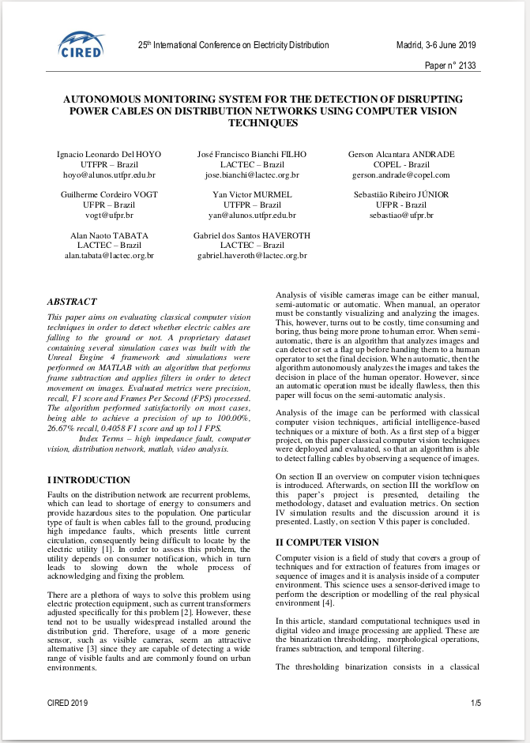
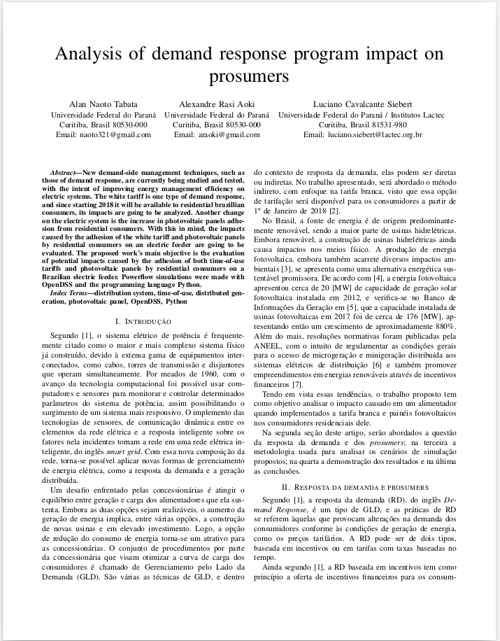

# Hey there!

Currently an intern at Audi Electronics Venture developing software for virtual simulations. At the same time, I'm finishing my master's double degree between Federal University of Parana (Brazil) and Technische Hochschule Ingolstadt (Germany) on electrical and international automotive engineering.

In my spare time I enjoy building and sharing some of my programs with the community.
Feel free to take a look around!

Alan

---

# Got papers?
<link rel="stylesheet" href="assets/css/papers_table.css">

<table rules="none">
  <tr class="noBorder">
    <td>
        <u1>
            <li>Filho et al., 2019. 
            <a href="https://www.cired-repository.org/handle/20.500.12455/745">
            Autonomous monitoring system for the detection of disrupting power cables on distribution networks using computer vision techniques. CIRED 2019, Madrid.</a></li>
        </u1>
    </td>
    <td>
        
    </td>
  </tr>
</table>

<b>

<table rules="none">
  <tr class="noBorder">
    <td>
        <u1>
            <li> A. N. Tabata, A. R. Aoki and L. C. Siebert, 2018.
            <a href="https://ieeexplore.ieee.org/document/8395698">
            Analysis of demand response program impact on prosumers. SBSE 2018, Niteroi.</a></li>
        </u1>
    </td>
    <td>
        
    </td>
  </tr>
</table>

<b>

<table rules="none">
  <tr class="noBorder">
    <td>
        <u1>
            <li> G. M. d. S. Pereira, A. N. Tabata, L. C. Siebert, C. C. Durce and R. Kowaltschuk, 2018.
            <a href="https://ieeexplore.ieee.org/document/8395586">
            Analysis of undervoltage load shedding by conservation voltage reduction. SBSE 2018, Niteroi.</a></li>
        </u1>
    </td>
    <td>
        
    </td>
  </tr>
</table>

<b>

<table rules="none">
  <tr class="noBorder">
    <td>
        <u1>
            <li> G. M. dos Santos Pereira, A. N. Tabata, F. J. Lachovicz, C. C. Durce and R. Kowaltschuk, 2018.
            <a href="https://ieeexplore.ieee.org/document/8756353">
            Electrical Power Quality Analysis of Under Voltage Load Shedding with a Battery Energy Storage System Support in the Brazilian Context. EPIM 2018, Uruguay.</a></li>
        </u1>
    </td>
    <td>
        
    </td>
  </tr>
</table>
